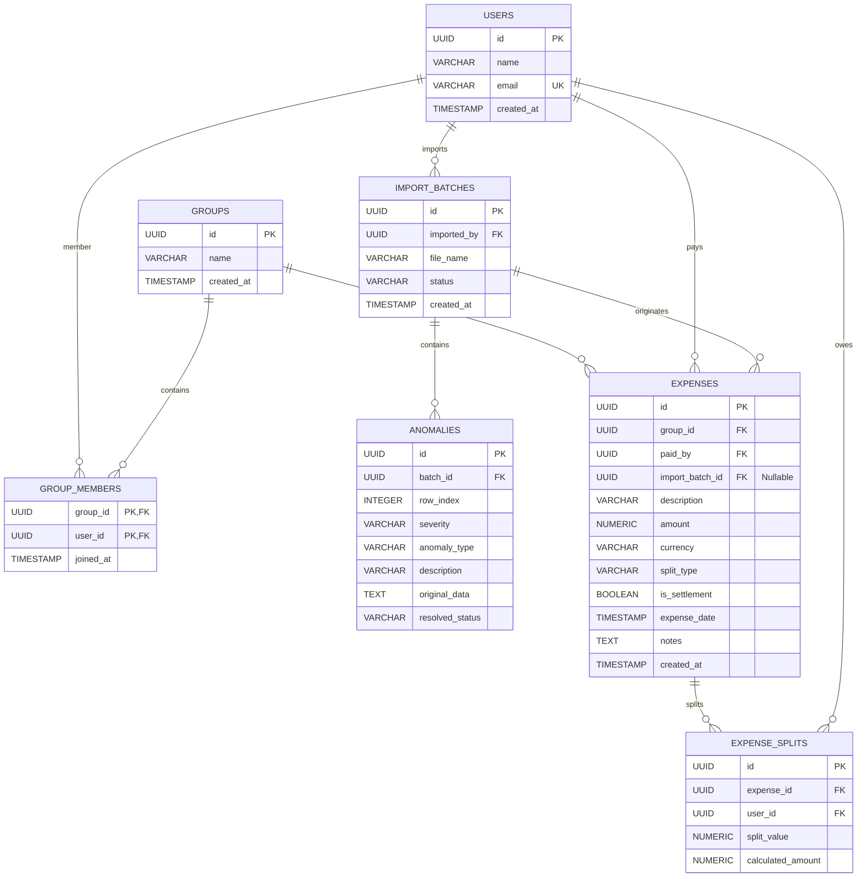
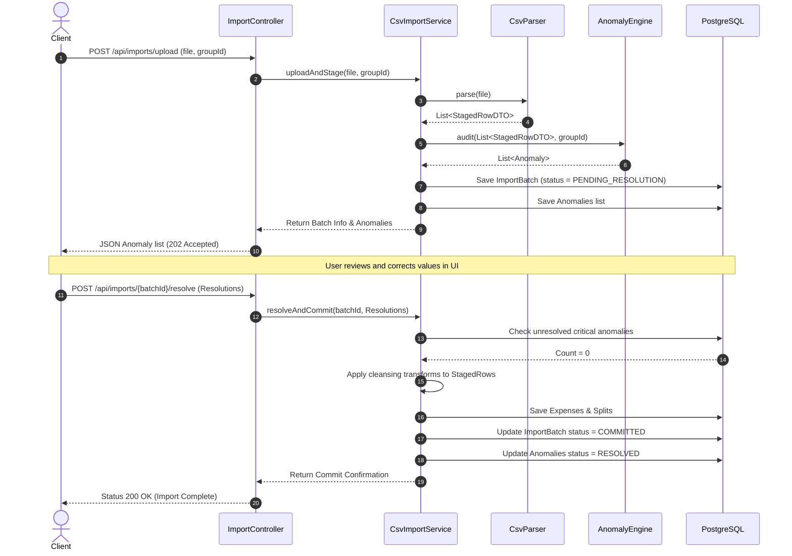

# Backend Architecture Design: Splitwise Clone & Anomaly Detector

This document outlines the Spring Boot and PostgreSQL backend architecture design for the Splitwise Clone and Anomaly Detector system.

---

## 1. Entity Relationship Diagram (ERD)



---

## 2. Database Schema (DDL)

The database uses PostgreSQL 16+. We will use raw types (`UUID`) for high-performance indexing and `NUMERIC(15, 4)` for precise currency math.

```sql
-- DDL for Splitwise and Anomaly Detector Database

-- Enable UUID extension
CREATE EXTENSION IF NOT EXISTS "uuid-ossp";

-- 1. Users Table
CREATE TABLE users (
    id UUID PRIMARY KEY DEFAULT uuid_generate_v4(),
    name VARCHAR(100) NOT NULL,
    email VARCHAR(150) UNIQUE NOT NULL,
    created_at TIMESTAMP DEFAULT CURRENT_TIMESTAMP NOT NULL
);

-- 2. Groups Table
CREATE TABLE groups (
    id UUID PRIMARY KEY DEFAULT uuid_generate_v4(),
    name VARCHAR(100) NOT NULL,
    created_at TIMESTAMP DEFAULT CURRENT_TIMESTAMP NOT NULL
);

-- 3. Group Members Table (Join Table)
CREATE TABLE group_members (
    group_id UUID REFERENCES groups(id) ON DELETE CASCADE,
    user_id UUID REFERENCES users(id) ON DELETE CASCADE,
    joined_at TIMESTAMP DEFAULT CURRENT_TIMESTAMP NOT NULL,
    PRIMARY KEY (group_id, user_id)
);

-- 4. Import Batches Table
CREATE TABLE import_batches (
    id UUID PRIMARY KEY DEFAULT uuid_generate_v4(),
    imported_by UUID REFERENCES users(id) ON DELETE SET NULL,
    file_name VARCHAR(255) NOT NULL,
    status VARCHAR(50) NOT NULL, -- e.g., 'PROCESSING', 'PENDING_RESOLUTION', 'COMMITTED', 'FAILED'
    created_at TIMESTAMP DEFAULT CURRENT_TIMESTAMP NOT NULL
);

-- 5. Anomalies Table
CREATE TABLE anomalies (
    id UUID PRIMARY KEY DEFAULT uuid_generate_v4(),
    batch_id UUID REFERENCES import_batches(id) ON DELETE CASCADE NOT NULL,
    row_index INT NOT NULL,
    severity VARCHAR(20) NOT NULL, -- 'CRITICAL', 'WARNING', 'INFO'
    anomaly_type VARCHAR(50) NOT NULL, -- 'DUPLICATE_EXPENSE', 'MISSING_FIELD', 'SPLIT_IMBALANCE', etc.
    description TEXT NOT NULL,
    original_data TEXT NOT NULL, -- JSON formatted string of raw row values
    resolved_status VARCHAR(30) NOT NULL DEFAULT 'UNRESOLVED' -- 'UNRESOLVED', 'RESOLVED', 'IGNORED'
);

-- 6. Expenses Table
CREATE TABLE expenses (
    id UUID PRIMARY KEY DEFAULT uuid_generate_v4(),
    group_id UUID REFERENCES groups(id) ON DELETE CASCADE NOT NULL,
    paid_by UUID REFERENCES users(id) ON DELETE RESTRICT NOT NULL,
    import_batch_id UUID REFERENCES import_batches(id) ON DELETE SET NULL,
    description VARCHAR(255) NOT NULL,
    amount NUMERIC(15, 4) NOT NULL,
    currency VARCHAR(10) NOT NULL DEFAULT 'INR',
    split_type VARCHAR(30) NOT NULL, -- 'EQUAL', 'UNEQUAL', 'PERCENTAGE', 'SHARE'
    is_settlement BOOLEAN DEFAULT FALSE NOT NULL,
    expense_date TIMESTAMP NOT NULL,
    notes TEXT,
    created_at TIMESTAMP DEFAULT CURRENT_TIMESTAMP NOT NULL
);

-- 7. Expense Splits Table
CREATE TABLE expense_splits (
    id UUID PRIMARY KEY DEFAULT uuid_generate_v4(),
    expense_id UUID REFERENCES expenses(id) ON DELETE CASCADE NOT NULL,
    user_id UUID REFERENCES users(id) ON DELETE CASCADE NOT NULL,
    split_value NUMERIC(15, 4) NOT NULL, -- Value of percentage, share, or specific amount
    calculated_amount NUMERIC(15, 4) NOT NULL -- Split amount in transaction currency
);

-- Indexes for performance optimizations
CREATE INDEX idx_expenses_group ON expenses(group_id);
CREATE INDEX idx_expense_splits_user ON expense_splits(user_id);
CREATE INDEX idx_anomalies_batch ON anomalies(batch_id);
```

---

## 3. REST API Design

All requests and responses use JSON. Files are uploaded via `multipart/form-data`.

### 3.1. Group Management & Balances
* **`GET /api/groups/{groupId}/balances`**
  * *Description*: Retrieve aggregated net balances (who owes whom) in the base currency (INR).
  * *Response*:
    ```json
    {
      "groupId": "3fa85f64-5717-4562-b3fc-2c963f66afa6",
      "baseCurrency": "INR",
      "balances": [
        { "userId": "a8b9c1d2-...", "name": "Aisha", "netBalance": 18450.00 },
        { "userId": "e3f4g5h6-...", "name": "Rohan", "netBalance": -5200.00 }
      ]
    }
    ```
* **`GET /api/groups/{groupId}/simplified-debts`**
  * *Description*: Execute the debt minimization algorithm and output the optimal settlements checklist.
  * *Response*:
    ```json
    [
      {
        "fromUserId": "e3f4g5h6-...",
        "fromUserName": "Rohan",
        "toUserId": "a8b9c1d2-...",
        "toUserName": "Aisha",
        "amount": 5200.00,
        "currency": "INR"
      }
    ]
    ```

### 3.2. Import & Anomaly Management
* **`POST /api/imports/upload`**
  * *Description*: Upload CSV file containing group expenses. The backend parses and runs validations, returning an import report. Nothing is committed to the main `expenses` table.
  * *Form Data*: `file` (binary), `groupId` (UUID), `importedByUserId` (UUID)
  * *Response (202 Accepted)*:
    ```json
    {
      "batchId": "b1b2b3b4-...",
      "fileName": "Expenses Export.csv",
      "status": "PENDING_RESOLUTION",
      "anomaliesCount": { "CRITICAL": 3, "WARNING": 4, "INFO": 2 },
      "anomalies": [
        {
          "anomalyId": "9a8b7c6d-...",
          "rowIndex": 15,
          "severity": "CRITICAL",
          "anomalyType": "SPLIT_PERCENTAGE_IMBALANCE",
          "description": "Percentage split total equals 110%, expected 100%",
          "originalData": "{...}"
        }
      ]
    }
    ```
* **`POST /api/imports/{batchId}/resolve`**
  * *Description*: Submit a map of resolutions for the batch's anomalies. Once all critical anomalies are resolved, the batch state changes to `COMMITTED` and records are written to `expenses` and `expense_splits`.
  * *Request Body*:
    ```json
    {
      "resolutions": [
        {
          "anomalyId": "9a8b7c6d-...",
          "action": "NORMALIZE_PERCENTAGES",
          "customData": { "Aisha": 27.27, "Rohan": 27.27, "Priya": 27.27, "Meera": 18.18 }
        },
        {
          "anomalyId": "1a2b3c4d-...",
          "action": "RESOLVE_PAYER",
          "customData": { "paidBy": "Aisha" }
        }
      ]
    }
    ```
  * *Response (200 OK)*:
    ```json
    {
      "batchId": "b1b2b3b4-...",
      "status": "COMMITTED",
      "message": "Import batch successfully parsed, resolved, and committed to main ledger. 42 expenses recorded."
    }
    ```

---

## 4. Service Layer Design

The system divides business logic into focused services, decoupled from controller wrappers.

```
┌─────────────────────────────────────────────────────────────────────────┐
│                        Controller (REST API)                            │
└────────────────────────────────────┬────────────────────────────────────┘
                                     │
                                     ▼
┌─────────────────────────────────────────────────────────────────────────┐
│                          CsvImportService                               │
├─────────────────────────────────────────────────────────────────────────┤
│ + uploadAndStage(file, groupId, userId) : ImportBatch                   │
│ + resolveAndCommit(batchId, resolutions) : ImportBatch                  │
└───────┬────────────────────────────┬─────────────────────────────┬──────┘
        │                            │                             │
        ▼                            ▼                             ▼
┌──────────────┐             ┌──────────────┐             ┌──────────────┐
│  CsvParser   │             │AnomalyEngine │             │ DebtEngine   │
└──────────────┘             └──────────────┘             └──────────────┘
```

### 4.1. `CsvParser`
* **Purpose**: Parse raw bytes from the CSV stream line-by-line using custom regex patterns.
* **Responsibilities**:
  * Extract rows safely, handling string-quoted amounts like `"1,200"` and multi-line fields.
  * Return a collection of unvalidated domain objects containing raw strings (`StagedRowDTO`).

### 4.2. `AnomalyEngine`
* **Purpose**: Business rule validator that scans `StagedRowDTO`s and outputs `Anomaly` records.
* **Rule Definitions**:
  * **Entity Resolver Rule**: Match user names against active group members. If close matches exist (Levenshtein distance $\le 2$ or casing variations), generate a `WARNING` anomaly suggesting a mapping.
  * **Split Integrity Rule**: If split type is `percentage` or `share`, parse details and check sums. If percentage $\ne 100\%$, generate `CRITICAL` anomaly.
  * **Direct Settlement Rule**: Identify peer transfers (e.g. description contains "paid back") and log as direct settlements (`is_settlement = true`).
  * **Chronology Audit Rule**: Check date sequences against average ranges. Flag malformed formats (e.g. `Mar-14`) as `CRITICAL` or `WARNING`.

### 4.3. `DebtEngineService`
* **Purpose**: State calculations for net balances and settlements.
* **Algorithm (Min-Max Greedy flow)**:
  1. Retrieve all non-deleted expenses for `groupId`.
  2. Compute base amounts (convert USD to INR using the configured currency exchange rate).
  3. For each expense:
     * Add `amount` to the `paid_by` user's ledger balance (Credit).
     * For each entry in `expense_splits`, subtract the split's `calculated_amount` from the respective user's ledger balance (Debit).
  4. Generate net balances: $Balance_i = Credit_i - Debit_i$.
  5. Run minimization algorithm:
     * Partition members into lists of `Creditors` ($Bal > 0$) and `Debtors` ($Bal < 0$).
     * Sort lists by absolute balance size in descending order.
     * Settle the smallest absolute value of the topmost debtor and creditor:
       $$Payment = \min(|Debtor_{top}|, Creditor_{top})$$
     * Record payment: `Debtor` pays `Creditor` $Payment$.
     * Update balances. Remove users who reach 0. Re-sort and loop until all balances settle.

---

## 5. Repository Layer Design

Repositories extend Spring Data JPA interfaces. We implement custom JPQL queries to avoid loading excessive object trees.

### 5.1. `UserRepository`
```java
public interface UserRepository extends JpaRepository<User, UUID> {
    Optional<User> findByEmail(String email);
    
    @Query("SELECT u FROM User u JOIN group_members gm ON u.id = gm.user_id WHERE gm.group_id = :groupId")
    List<User> findActiveMembersByGroupId(@Param("groupId") UUID groupId);
}
```

### 5.2. `ExpenseRepository`
```java
public interface ExpenseRepository extends JpaRepository<Expense, UUID> {
    List<Expense> findByGroupId(UUID groupId);
    
    @Query("SELECT e FROM Expense e WHERE e.groupId = :groupId AND e.isSettlement = false")
    List<Expense> findGroupExpensesOnly(@Param("groupId") UUID groupId);
}
```

### 5.3. `AnomalyRepository`
```java
public interface AnomalyRepository extends JpaRepository<Anomaly, UUID> {
    List<Anomaly> findByBatchId(UUID batchId);
    
    @Query("SELECT COUNT(a) FROM Anomaly a WHERE a.batchId = :batchId AND a.resolvedStatus = 'UNRESOLVED' AND a.severity = 'CRITICAL'")
    long countUnresolvedCriticalAnomalies(@Param("batchId") UUID batchId);
}
```

---

## 6. Import Workflow Execution Sequence

The staging, auditing, resolution, and commit cycle is modeled in the sequence below:


