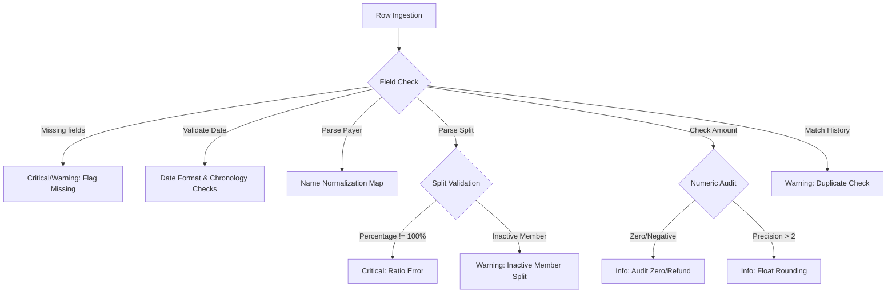

# CSV Data Engineering Analysis: Expenses Export

This document provides a data engineering audit of the `Expenses Export.csv` dataset, outlining the schema, column-level characteristics, and a detailed catalog of data anomalies, followed by recommended programmatic detection rules.

---

## 1. Schema & Column Overview

The CSV contains **43 data records** (plus 1 header row) with 9 columns.

| Column | Data Type | Expected Format / Values | Description |
| :--- | :--- | :--- | :--- |
| `date` | Date | `DD-MM-YYYY` | The date the transaction occurred. |
| `description` | Text | Free-form string | Purpose of the expense. |
| `paid_by` | Text | String (Group member name) | The entity who paid for the expense. |
| `amount` | Number | Numeric (Decimal or Integer) | Total cost of the transaction. |
| `currency` | Text | `INR` or `USD` | The ISO currency code. |
| `split_type` | Text | `equal`, `unequal`, `percentage`, `share` | Algorithm style for dividing the expense. |
| `split_with` | Text | Semicolon-separated names | Entities sharing the expense. |
| `split_details` | Text | Key-value string based on `split_type` | Breakdowns (e.g. `Rohan 700; Priya 400`). |
| `notes` | Text | Free-form string | Comments or explanations from loggers. |

---

## 2. Detailed Anomaly Catalog

A line-by-line review of the export reveals 11 distinct types of anomalies.

### 2.1. Duplicate & Overlapping Expenses
* **Exact Duplicate (Lines 5 & 6)**:
  * **Line 5**: `08-02-2026,Dinner at Marina Bites,Dev,3200,INR,equal,Aisha;Rohan;Priya;Dev,,Dev visiting for the weekend`
  * **Line 6**: `08-02-2026,dinner - marina bites,Dev,3200,INR,equal,Aisha;Rohan;Priya;Dev,,`
  * *Analysis*: Same date, payer, amount, and split group. Only difference is casing in description and notes. One is redundant.
* **Conflicting Duplicate Logs (Lines 24 & 25)**:
  * **Line 24**: `11-03-2026,Dinner at Thalassa,Aisha,2400,INR,equal,Aisha;Rohan;Priya;Dev,,`
  * **Line 25**: `11-03-2026,Thalassa dinner,Rohan,2450,INR,equal,Aisha;Rohan;Priya;Dev,,Aisha also logged this I think hers is wrong`
  * *Analysis*: Two entries for the same group dinner. Payer and amount conflict (Aisha ₹2400 vs Rohan ₹2450). Note on line 25 highlights this collision.

### 2.2. Duplicate Users & Entity Resolution
* **Casing Variations**: `Priya` vs `priya` (Line 9), `Rohan` vs `rohan ` (Line 27).
* **Trailing Whitespace**: `rohan ` (Line 27) includes a trailing space.
* **Name Mutation / Suffixes**: `Priya` vs `Priya S` (Line 11).
  * *Analysis*: Data ingestion must normalize these to a canonical member set (`Aisha`, `Rohan`, `Priya`, `Meera`, `Dev`, `Sam`, `Kabir`).

### 2.3. Missing Values
* **Missing Payer (Line 13)**: `House cleaning supplies,,780,INR` has an empty `paid_by` column. Note: "can't remember who paid".
* **Missing Currency (Line 28)**: `Groceries DMart,Priya,2105,,equal` has an empty `currency` column. Note: "forgot to set currency".
* **Missing Split Type (Line 14)**: `Rohan paid Aisha back,Rohan,5000,INR,,Aisha,,this is a settlement...` has an empty `split_type`.

### 2.4. Invalid & Ambiguous Dates
* **Malformed Format (Line 27)**: `Mar-14` is logged instead of `14-03-2026`. Missing year and reversed order.
* **Ambiguous Date Order (Line 34)**: `04-05-2026` is annotated "is this April 5 or May 4? format is a mess".
  * *Chronological Context*: Line 33 is `28-03-2026` (March 28), and Line 35 is `01-04-2026` (April 1). If the date is May 4, it is highly out of order. If it is April 5, it is also out of order, but closer. If it represents `05-04-2026` (April 5) written as `MM-DD-YYYY` by mistake, or if it is April 4 (`04-04-2026`) or May 4 logged late, it needs verification.

### 2.5. Currency Inconsistencies
* **Multi-Currency Mix**: The export contains both `INR` (Indian Rupee) and `USD` (US Dollars).
  * *USD Lines*: Line 20 (540 USD), Line 21 (84 USD), Line 23 (150 USD), Line 26 (-30 USD).
  * *Impact*: High-level aggregations and balance settlements require conversion to a base currency.

### 2.6. Numeric Anomalies (Precision & Negative Values)
* **High Precision Float (Line 10)**: `Cylinder refill,Rohan,899.995,INR`. Standard Indian Rupee displays do not use 3 decimal places.
* **Negative Expense (Line 26)**: `Parasailing refund,Dev,-30,USD`. Represents a refund. In Splitwise logic, a negative expense reduces the total cost and pays back participants, but must be distinguished from normal debt calculations.
* **Zero-Value Expense (Line 31)**: `Dinner order Swiggy,Priya,0,INR`. Amount is `0`. Note: "counted twice earlier - fixing later".

### 2.7. Settlement Records Mixed with Expenses
* **Direct Settlement (Line 14)**: `25-02-2026,Rohan paid Aisha back,Rohan,5000,INR,,Aisha,,this is a settlement...`
* **Direct Transfer (Line 38)**: `08-04-2026,Sam deposit share,Sam,15000,INR,equal,Aisha,,Sam moving in! paid Aisha his deposit`
  * *Impact*: These are private 1-to-1 transfers, not expenses to be split. Treating them as standard expenses splits them among the target members, which is mathematically incorrect.

### 2.8. Split Detail Inconsistencies
* **Sum Exceeds 100% (Lines 15 & 32)**:
  * `Aisha 30%; Rohan 30%; Priya 30%; Meera 20%` splits equal 110%.
* **Redundant Configuration (Line 42)**: `Furniture for common room` split_type is `equal`, but split_details specifies `Aisha 1; Rohan 1; Priya 1; Sam 1` (shares).

### 2.9. Participant & Group Membership Inconsistencies
* **Split with Inactive Members (Line 36)**:
  * **Line 33 (28-03-2026)**: Meera has a farewell dinner. Note says: "Meera moving out Sunday".
  * **Line 36 (02-04-2026)**: `02-04-2026,Groceries BigBasket... equal, Aisha;Rohan;Priya;Meera`. Note: "oops Meera still in the group list".
  * *Analysis*: Meera moved out on March 29, but is charged for groceries on April 2. This is a participant inclusion error.
* **Temporary Group Expansions**:
  * **Line 23 (11-03-2026)**: Parasailing includes `Dev's friend Kabir` in the split but Dev paid. This adds a temporary participant to the group balance sheets.

---

## 3. Suggested Anomaly Detection Rules

To build a reliable Anomaly Detection Engine, the application should programmatically apply the following rules:

### Rule 1: Name Normalization (Entity Resolution)
* **Logic**: Convert names to lowercase, trim whitespaces, strip punctuation, and match against a canonical user list using a levenshtein-distance or string matching dictionary.
* **Triggers**: If name differs from canonical name (e.g. "priya" != "Priya").

### Rule 2: Date Parsing & Chronological Sequence Check
* **Logic**: Parse date string using multiple fallback regex patterns (`/^\d{2}-\d{2}-\d{4}$/`, `/^[A-Za-z]{3}-\d{2}$/`). Verify if the row's date is chronologically before the previous row's date by more than a threshold (e.g., 3 days), flagging potential entry errors.
* **Triggers**: Unparseable format, missing year, or extreme sequence backtrack.

### Rule 3: Split Percentage Integrity
* **Logic**: If `split_type == 'percentage'`, parse weights in `split_details`. Sum the numeric values.
* **Triggers**: Sum is not equal to `100` (e.g. `110`).

### Rule 4: Duplicate Expense Heuristics
* **Logic**: Run a slide window over transactions. If two transactions occur within $\pm 1$ day, share the same `amount` (after currency conversion), same `paid_by`, and have a description similarity index (e.g. Jaccard similarity) $> 60\%$.
* **Triggers**: Suspected duplicate matches found.

### Rule 5: Active Membership Boundaries
* **Logic**: Maintain an activity timeline for each user:
  * `Meera`: Active `Start` to `2026-03-29`.
  * `Sam`: Active `2026-04-08` to `End`.
  * `Dev`: Active only during Goa trip `2026-03-08` to `2026-03-12`.
* **Triggers**: If transaction date is outside a user's active window but they are included in `split_with`.

### Rule 6: Settlement Identification
* **Logic**: If `split_type` is empty AND `split_with` contains exactly one member AND description matches keywords (`paid back`, `settlement`, `returned money`, `deposit`).
* **Triggers**: Flag transaction as "Direct Settlement" to prevent standard division.
